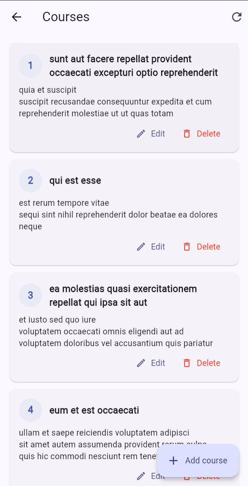
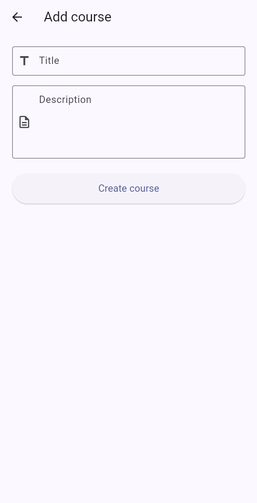
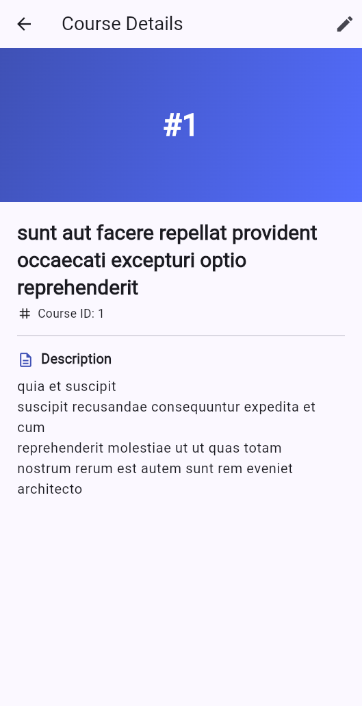

# Multi-Screen Flutter Application

A multi-screen Flutter application featuring user authentication, comprehensive
form validation, session persistence, navigation, **full REST CRUD against a
live API**, **offline support with a local Hive cache**, **Provider-based
state management**, and a **repository-pattern** architecture — built using
clean separation between UI, state, repository, and service layers.

**Repository:** [github.com/Haris357/flutter-multi-screen-app](https://github.com/Haris357/flutter-multi-screen-app)

**Current feature branch:** `feature/offline-cache-and-state-manangement`

## Student Information

| Field        | Detail                               |
|--------------|--------------------------------------|
| Student Name | Haris                                |
| Student ID   | Se231097                             |
| Project      | Multi-Screen Application Development  |

## Tools and Packages Used

| Package             | Purpose                                                  |
|---------------------|----------------------------------------------------------|
| `provider`          | State management (ChangeNotifier exposure to widget tree)|
| `hive` + `hive_flutter` | Local NoSQL cache for offline course data            |
| `connectivity_plus` | Online/offline detection and reactive connectivity stream|
| `http`              | REST calls to JSONPlaceholder                            |
| `shared_preferences`| Persists the authenticated session ("Remember Me")       |
| `cupertino_icons`   | iOS-style icons                                          |

## Architecture Explanation

This branch reorganises the app into the layered architecture required by the
assignment:

```
UI (screens) → State Management (Provider + ChangeNotifier)
            → Repository (CourseRepository)
            → API Service (CourseApiService)  +  Local Database (Hive)
```

### Layer responsibilities

- **UI layer (`lib/screens/`)** — pure Flutter widgets. Reads state with
  `context.watch<T>()`, triggers actions with `context.read<T>()`. Never
  imports `http`, `hive`, or `connectivity_plus`.
- **State management (`lib/controllers/course_controller.dart`)** —
  `CourseController extends ChangeNotifier`, exposed via `Provider`. Owns
  the in-memory `courses` list, the `CourseLoadState` enum
  (`idle`/`loading`/`loaded`/`error`), an `errorMessage`, an `isOffline`
  flag, and the optimistic-update logic.
- **Repository (`lib/repositories/course_repository.dart`)** — the only
  class that decides whether a request goes to the network, the cache, or
  both. Exposes `loadCourses()`, `createCourse()`, `updateCourse()`,
  `deleteCourse()` and a connectivity stream.
- **API service (`lib/services/course_api_service.dart`)** — pure HTTP.
  GET/POST/PUT/DELETE against `jsonplaceholder.typicode.com/posts`, with
  timeouts and a typed `CourseApiException`. No business logic.
- **Local database (`lib/services/course_local_storage.dart`)** — Hive
  boxes for cached courses + a "last updated" timestamp. Stored as
  `Map<String, dynamic>` (no code-gen needed).
- **Connectivity (`lib/services/connectivity_service.dart`)** — thin
  wrapper around `connectivity_plus` exposing `isOnline()` and a distinct
  `onStatusChange` stream.

### State management approach

The previous branch (`feature/course-api-integration`) used a hand-rolled
`InheritedNotifier` to expose controllers to the tree. This branch upgrades
to **Provider**:

- `main.dart` wraps the app in `MultiProvider` with
  `ChangeNotifierProvider<AuthController>` and
  `ChangeNotifierProvider<CourseController>`.
- Screens use `context.watch<CourseController>()` to rebuild on state
  changes and `context.read<CourseController>()` for one-shot calls inside
  event handlers (button taps, dialogs, navigation results).
- The controller now exposes `state`, `courses`, `errorMessage`,
  `isOffline`, `lastSource`, `lastUpdated` and `fellBackToCache`, giving
  the UI a precise model of every loading/success/error/empty branch.

### Offline approach

The offline behaviour is implemented entirely in the repository — neither
the API service nor the controller has to know whether the device is
online:

1. **On load** — the repository checks connectivity. If offline it returns
   the Hive cache directly. If online it calls the API, **mirrors the
   response into Hive**, and returns the fresh data.
2. **On API failure while online** — falls back to the cache and returns
   `fellBackToCache: true` so the UI can show a banner.
3. **On create / update / delete** — the API call goes first; the cache is
   updated only after the API confirms success. This keeps the cache in
   step with the server.
4. **Auto-sync on reconnect** — `CourseController` subscribes to the
   connectivity stream. The moment the device transitions from offline to
   online, `loadCourses()` is re-run so the cache is refreshed against the
   live API.
5. **Offline banner** — the Courses screen displays a persistent orange
   banner while the user is offline, and the dashboard preview swaps its
   subtitle to "Offline — showing cached courses".

### Optimistic UI updates

Update and delete are implemented optimistically with rollback:

- **Update** — the targeted course is replaced in the in-memory list and
  the UI rebuilds immediately. The API call runs afterwards; on failure
  the previous course is restored at the same index and an error
  `SnackBar` appears.
- **Delete** — the course is removed from the list before the network
  call. On failure it is re-inserted at the original index and the error
  is surfaced via `SnackBar`.
- **Create** — runs API-first (the new id is part of the response), then
  inserts into the list. With JSONPlaceholder's fake response always
  returning `id: 101`, the controller assigns the next unused local id so
  multiple new courses remain distinguishable.

### Repository pattern summary

```
CourseRepository
    ├─ CourseApiService          (HTTP only)
    ├─ CourseLocalStorage        (Hive only)
    └─ ConnectivityService       (connectivity_plus only)
```

Each underlying service has exactly one responsibility. The controller
talks **only** to the repository, never to a service directly. Swapping
the API or the local store does not require touching any UI code.

## Screenshots

| Registration | Login |
|--------------|-------|
|  |  |

| Dashboard (offline-aware preview) | Courses list (CRUD + search + offline) |
|-----------------------------------|----------------------------------------|
|  |  |

| Add / Edit course | Course detail |
|-------------------|---------------|
|  |  |

> The CRUD screenshots come from the earlier
> `feature/course-api-integration` branch and remain accurate. New
> screenshots showing the **offline banner** and **search bar** can be
> dropped in as e.g. `screenshots/CoursesOffline.png` and
> `screenshots/CoursesSearch.png` and linked from this README.

## Features

### 1. Registration Screen

- First name, last name, email, gender (dropdown) and password fields.
- Password security rules: minimum 6 characters, at least 1 uppercase letter
  and at least 1 special character.
- Confirm-password field that must match the original password.
- Real-time validation feedback on every field.
- Submit button stays **disabled** until the whole form is valid.
- On success: shows a success message and navigates to the Login screen.

### 2. Login Screen

- Email field with format validation and inline error messages.
- Password field with a show/hide (eye icon) toggle.
- "Remember Me" checkbox that persists the session across app restarts.
- Validates credentials; on success navigates to the Dashboard, passing the
  user data.

### 3. Dashboard Screen

- Displays the user's name, email and an avatar placeholder (initials).
- Live "Your Courses" preview pulled from the JSONPlaceholder API.
- Swaps the subtitle to "Offline — showing cached courses" when the device
  is offline, so the source of the list is always clear.
- Buttons to open the full Courses screen ("View all") and to jump straight
  into adding a new course.
- Logout button (with confirmation) returns to the Login screen.

### 4. Courses Screen (CRUD + offline + search)

- **Read (GET)** — fetches the course list on first open, shows a
  `CircularProgressIndicator` while loading and an error view with a retry
  button on failure. Pull-to-refresh and an app-bar refresh action both
  trigger a re-fetch.
- **Create (POST)** — floating "Add course" button opens a form. On success
  the new course is prepended to the list and a confirmation snack-bar
  appears.
- **Update (PUT, optimistic)** — each course card has an Edit action that
  opens the same form pre-filled with existing data. The list updates
  before the network call returns and rolls back if the API fails.
- **Delete (DELETE, optimistic)** — each course card has a Delete action
  that opens a confirmation dialog. The card disappears immediately on
  confirm; if the API fails it is re-inserted at the same index.
- **Offline banner** — visible when the cache is in use, so the user knows
  the list might be stale.
- **Search/filter** — an always-visible search field at the top filters by
  title or description as the user types.
- **Empty states** — distinct messages for "no courses yet" vs "no results
  for this search query".

### 5. Course Detail Screen

- Banner with the course id.
- Course title, id and full description.
- Edit shortcut in the app bar.
- Falls back to a single `GET /posts/{id}` request if the course is not
  already in the controller's cached list.

## Architecture

The project separates UI from business logic into dedicated layers:

```text
lib/
├── main.dart                          App entry: Hive init + MultiProvider wiring
├── enums/
│   └── app_enums.dart                 Gender, AuthState, AuthStatus enums
├── models/
│   ├── user_model.dart                Immutable user model (+ JSON serialization)
│   └── course_model.dart              Immutable course model (+ JSON serialization)
├── validators/
│   └── validators.dart                Reusable, UI-independent validation logic
├── services/
│   ├── session_service.dart           SharedPreferences-backed session storage
│   ├── course_api_service.dart        HTTP service for /posts (GET/POST/PUT/DELETE)
│   ├── course_local_storage.dart      Hive-backed offline cache for courses
│   └── connectivity_service.dart      connectivity_plus wrapper
├── repositories/
│   └── course_repository.dart         Orchestrates API + cache + connectivity
├── controllers/
│   ├── auth_controller.dart           Authentication business logic
│   ├── course_controller.dart         Course state, CRUD + optimistic UI
│   └── navigation_controller.dart     Route names + navigation helpers
├── screens/
│   ├── registration_screen.dart
│   ├── login_screen.dart
│   ├── dashboard_screen.dart
│   ├── courses_screen.dart            CRUD list view + search + offline banner
│   ├── course_form_screen.dart        Shared create + edit form
│   └── course_detail_screen.dart      Single-course read view
└── widgets/
    ├── app_text_field.dart            Reusable validated text field
    └── primary_button.dart            Reusable button with loading/disabled state
```

### Key design points

- **Repository pattern** — `CourseRepository` is the only class that knows
  about both the API and the cache. Services do not know about each other.
- **Provider** — replaces the InheritedNotifier wiring from the previous
  branch. `MultiProvider` in `main.dart` exposes both controllers;
  screens use `context.watch` / `context.read`.
- **Hive offline cache** — courses are stored as JSON maps in a Hive box.
  No code-gen step is required because the model already exposes
  `toJson` / `fromJson`.
- **Optimistic UI with rollback** — `CourseController` snapshots the
  affected entry before mutation, applies the change to the in-memory
  list, notifies listeners, then awaits the API. Failures restore the
  snapshot at the same index and surface a `SnackBar`.
- **Connectivity awareness** — `CourseController` subscribes to a
  connectivity stream, exposes `isOffline`, and auto-refreshes the list
  when the device comes back online.
- **Custom Validator class** — `Validators` holds all email, password,
  empty field, name, confirm-password and selection validation. Pure
  logic with no UI dependency; unit-tested.
- **Session persistence** — "Remember Me" stores the session via
  `shared_preferences`, so a remembered user is taken straight to the
  Dashboard on the next app launch.

## API Used

This app integrates **[JSONPlaceholder](https://jsonplaceholder.typicode.com/)**,
a free fake REST API. The `/posts` endpoint is treated as the "courses"
resource with the following field mapping:

| Course field | JSONPlaceholder `/posts` field |
|--------------|--------------------------------|
| `id`         | `id`                           |
| `title`      | `title`                        |
| `description`| `body`                         |
| `userId`     | `userId` (defaults to `1`)     |

Endpoints exercised: GET (list + single), POST, PUT, DELETE — see
`lib/services/course_api_service.dart`. Documentation followed:
<https://jsonplaceholder.typicode.com/guide>.

## Getting Started

### Prerequisites

- Flutter SDK 3.41+ (Dart 3.11+)
- An internet connection for the first sync (offline reads work after that)

### Run the app

```bash
git checkout feature/offline-cache-and-state-manangement
flutter pub get
flutter run
```

To run in a browser instead:

```bash
flutter run -d chrome
```

### Run the tests

```bash
flutter test
```

The test suite covers the `Validators` class (email, password,
confirm-password and required-field rules) — 11 tests, all passing.

## Usage

1. Launch the app; the Login screen appears.
2. Tap **Register** and complete the registration form.
3. After successful registration you are returned to the Login screen.
4. Log in with the **same email and password** you just registered.
5. The Dashboard loads a live preview of courses from JSONPlaceholder
   (or from the Hive cache if you're offline).
6. Tap **View all** to open the CRUD screen. Try:
   - Pull-to-refresh to re-sync.
   - Typing in the search bar to filter courses.
   - Editing a course — the list updates immediately.
   - Deleting a course — the row disappears immediately.
   - Toggling airplane mode — the offline banner appears, the list keeps
     working from the cache, and a fresh sync runs the moment you come
     back online.

## Tech Stack

- **Flutter** (Material 3)
- **Dart**
- **provider** — Provider/ChangeNotifier state management
- **hive** + **hive_flutter** — local NoSQL cache for offline courses
- **connectivity_plus** — online/offline detection
- **http** — REST calls to JSONPlaceholder
- **shared_preferences** — local session persistence
- **JSONPlaceholder** — fake REST backend for course CRUD
  ([guide](https://jsonplaceholder.typicode.com/guide))

## Submission

- **Branch:** `feature/offline-cache-and-state-manangement`
- **Previous branch (CRUD only):** `feature/course-api-integration`
- **API:** JSONPlaceholder (`/posts` → courses)
- **State management:** Provider
- **Local storage:** Hive
- **Documentation followed:** <https://jsonplaceholder.typicode.com/guide>
