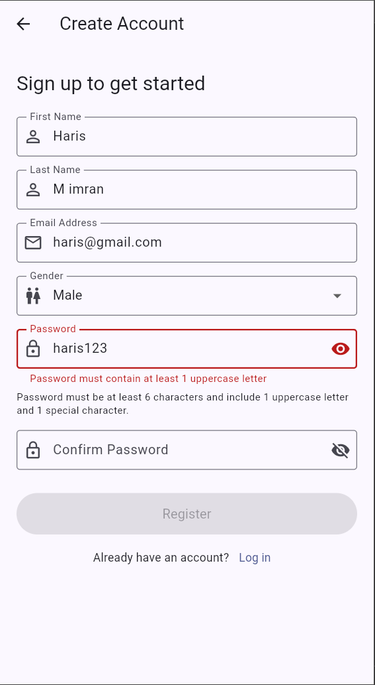
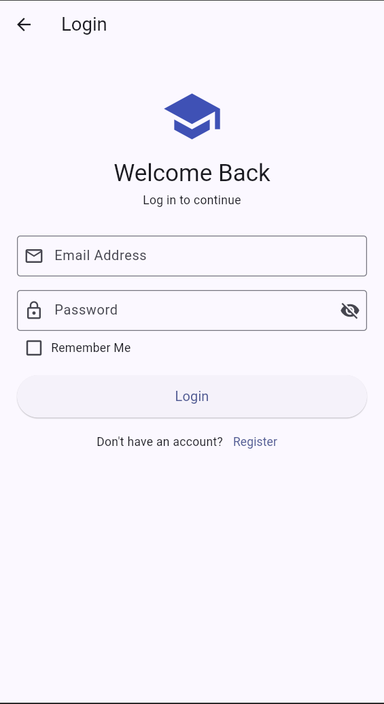
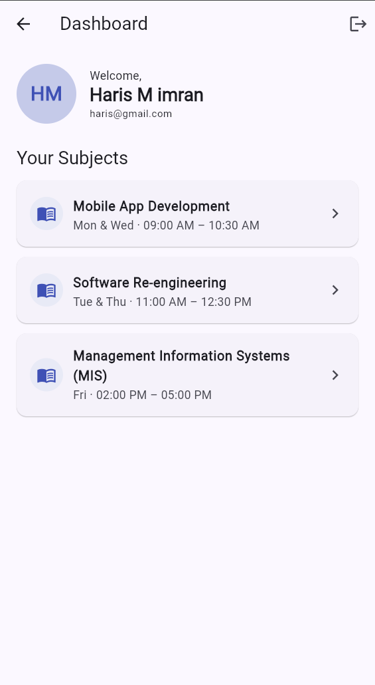
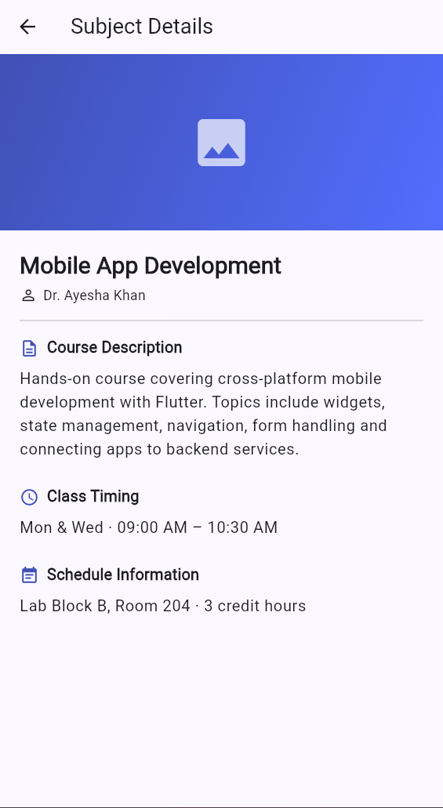

# Multi-Screen Flutter Application

A multi-screen Flutter application featuring user authentication, comprehensive
form validation, session persistence, and navigation — built using clean
architecture principles with a clear separation between UI and business logic.

**Repository:** [github.com/Haris357/flutter-multi-screen-app](https://github.com/Haris357/flutter-multi-screen-app)

## Student Information

| Field        | Detail                               |
|--------------|--------------------------------------|
| Student Name | Haris                                |
| Student ID   | Se231097                             |
| Project      | Multi-Screen Application Development  |

## Screenshots

| Registration | Login |
|--------------|-------|
|  |  |

| Dashboard | Detail |
|-----------|--------|
|  |  |

## Features

### 1. Registration Screen

- First name, last name, email, gender (dropdown) and password fields.
- Password security rules: minimum 6 characters, at least 1 uppercase letter
  and at least 1 special character.
- Confirm-password field that must match the original password.
- Real-time validation feedback on every field.
- Submit button stays **disabled** until the whole form is valid.
- On success: shows a success message and navigates to the Login screen.

### 2. Login Screen

- Email field with format validation and inline error messages.
- Password field with a show/hide (eye icon) toggle.
- "Remember Me" checkbox that persists the session across app restarts.
- Validates credentials; on success navigates to the Dashboard, passing the
  user data.

### 3. Dashboard Screen

- Displays the user's name, email and an avatar placeholder (initials).
- Dynamic list of subjects: Mobile App Development, Software Re-engineering,
  and Management Information Systems (MIS).
- Tapping a subject navigates to the Detail screen with that subject's data.
- Logout button (with confirmation) returns to the Login screen.

### 4. Detail Screen

- Subject name shown prominently in a header.
- Banner placeholder image.
- Course description, class timing and schedule information.

## Architecture

The project separates UI from business logic into dedicated layers:

```text
lib/
├── main.dart                       App entry point + startup/auto-login gate
├── enums/
│   └── app_enums.dart              Gender, AuthState, AuthStatus enums
├── models/
│   ├── user_model.dart             Immutable user model (+ JSON serialization)
│   └── subject_model.dart          Subject model + static subject catalogue
├── validators/
│   └── validators.dart             Reusable, UI-independent validation logic
├── services/
│   └── session_service.dart        SharedPreferences-backed session storage
├── controllers/
│   ├── auth_controller.dart        Authentication business logic
│   ├── auth_scope.dart             InheritedNotifier exposing the controller
│   └── navigation_controller.dart  Route names + navigation helpers
├── screens/
│   ├── registration_screen.dart
│   ├── login_screen.dart
│   ├── dashboard_screen.dart
│   └── detail_screen.dart
└── widgets/
    ├── app_text_field.dart         Reusable validated text field
    └── primary_button.dart         Reusable button with loading/disabled state
```

### Key design points

- **Custom Validator class** — `Validators` holds all email, password, empty
  field, name, confirm-password and selection validation. It is pure logic
  with no UI dependency and is unit-tested.
- **Enums** — `Gender` (dropdown values), `AuthState` (authentication state
  management) and `AuthStatus` (operation results).
- **Controller / service layer** — `AuthController` owns registration, login
  and logout logic; `SessionService` handles persistence; `NavigationController`
  centralises routing. Screens contain only UI and delegate to these.
- **Reusable components** — `AppTextField` and `PrimaryButton` standardise
  form inputs and actions across all screens.
- **Session persistence** — "Remember Me" stores the session via
  `shared_preferences`, so a remembered user is taken straight to the
  Dashboard on the next app launch.

## Getting Started

### Prerequisites

- Flutter SDK 3.41+ (Dart 3.11+)

### Run the app

```bash
flutter pub get
flutter run
```

To run in a browser instead (no Windows setup required):

```bash
flutter run -d chrome
```

### Run the tests

```bash
flutter test
```

The test suite covers the `Validators` class (email, password, confirm-password
and required-field rules) — 11 tests, all passing.

## Usage

This is a front-end demo with no backend — the registered user is stored
locally with `shared_preferences`.

1. Launch the app; the Login screen appears.
2. Tap **Register** and complete the registration form.
3. After successful registration you are returned to the Login screen.
4. Log in with the **same email and password** you just registered.
5. The Dashboard shows your details and the subject list; tap any subject for
   its details, or use the logout button to sign out.

## Tech Stack

- **Flutter** (Material 3)
- **Dart**
- **shared_preferences** — local session persistence
